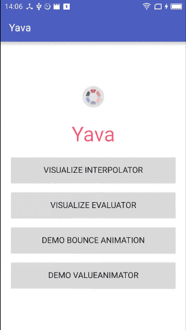

[中文说明](README-CN.md) [](https://www.jitpack.io/#hujiaweibujidao/yava)  [](http://android-arsenal.com/details/1/3639)  <a href="http://www.methodscount.com/?lib=com.github.hujiaweibujidao%3Ayava%3A1.0.0"></a>    

## Yava

> Yet Another View Animation ( a simple and elegant view animation helper library for Android)    

This library helps you convert any curve into ready-to-use `Interpolator` or `TypeEvaluator` for `ValueAnimator`, and thirty Rovert Penner's Easing Functions are already included.

You may read the following three articles to know about the reason why I create this project, and how to implement it. They fully described the relations among `ValueAnimator`、`TypeEvaluator` and `TimeInterpolator`, hope it helps.

[When Math Meets Animation(1)](http://hujiaweibujidao.github.io/blog/2016/05/26/when-math-meets-android-animation/)    
[When Math Meets Animation(2)](http://hujiaweibujidao.github.io/blog/2016/05/27/When-Math-meets-Android-Animation-2/)     
[When Math Meets Animation(3)](http://hujiaweibujidao.github.io/blog/2016/05/27/When-Math-meets-Android-Animation-3/)     

## Screenshot



## Usage

For example, if you want to create a `BOUNCE_OUT` animation, you can directly use `EasingFunction.BOUNCE_OUT` as `Interpolator` or `TypeEvaluator` for your `ValueAnimator`.

Option 1: use `LinearInterpolator` with `EasingFunction.BOUNCE_OUT` (as `TypeEvaluator`)

```java
ObjectAnimator animator1 = new ObjectAnimator();
animator1.setTarget(textView1);
animator1.setPropertyName("translationY");
animator1.setFloatValues(0f, -100f);
animator1.setDuration(1000);

animator1.setInterpolator(new LinearInterpolator());
animator1.setEvaluator(EasingFunction.BOUNCE_OUT); //use `EasingFunction.BOUNCE_OUT` as `TypeEvaluator`

animator1.start();
```

Option 2: use `EasingFunction.BOUNCE_OUT` (as `Interpolator`) with `FloatEvaluator` (`"Linear TypeEvaluator"`)

```java
ObjectAnimator animator2 = new ObjectAnimator();
animator2.setTarget(textView2);
animator2.setPropertyName("translationY");
animator2.setFloatValues(0f, -100f);
animator2.setDuration(1000);

animator2.setInterpolator(EasingFunction.BOUNCE_OUT); //use `EasingFunction.BOUNCE_OUT` as `Interpolator`
animator2.setEvaluator(new FloatEvaluator());

animator2.start();
```

Want to use your customized function curve? It's simple!    
Try `Functions.with(IFunction youFunctionImplementation)`!

Example 1: use it as `TypeEvaluator`

```java
ObjectAnimator animator1 = new ObjectAnimator();
animator1.setTarget(textView1);
animator1.setPropertyName("translationY");
animator1.setFloatValues(0f, -100f);
animator1.setDuration(1000);

animator1.setInterpolator(new LinearInterpolator());
animator1.setEvaluator(Functions.with(new IFunction() { //customized TypeEvaluator
    @Override
    public float getValue(float input) {
        return input * 2 + 3;
    }
}));

animator1.start();
```

Or you can also use it as `Interpolator`:

```java
ObjectAnimator animator2 = new ObjectAnimator();
animator2.setTarget(textView2);
animator2.setPropertyName("translationY");
animator2.setFloatValues(0f, -100f);
animator2.setDuration(1000);

animator2.setInterpolator(Functions.with(new IFunction() { //customized Interpolator
    @Override
    public float getValue(float input) {
        return input * 2 + 3;
    }
}));
animator2.setEvaluator(new FloatEvaluator());

animator2.start();
```

## Setup

Copy those four classes into your project, then you are set!

OR

1.add this in your `build.gradle` file in root project

```
allprojects {
    repositories {
        ...
        maven { url "https://www.jitpack.io" }
    }
}
```

2.add the following dependency

```
dependencies {
    compile 'com.github.hujiaweibujidao:yava:1.0.0'
}
```

## Documentation

There are only four core classes in `library`.

(1) `IFunction`: interface

```java
/**
 * Function Interface: given input, get the value result
 */
public interface IFunction {
    float getValue(float input);
}
```

(2)`AbstractFunction`: abstract class

```java
/**
 * abstract function, you can use it as `Interpolator` or `TypeEvaluator`
 */
public abstract class AbstractFunction implements IFunction, Interpolator, TypeEvaluator<Float> {

    @Override
    public float getInterpolation(float input) {
        return getValue(input);
    }

    @Override
    public Float evaluate(float fraction, Float startValue, Float endValue) {
        return startValue + getValue(fraction) * (endValue - startValue);
    }
}
```

(3)`Functions`: class

```java
/**
 * convert any function curve to ready-to-use AbstractFunction
 */
class Functions {

    public static AbstractFunction with(final IFunction function) {
        return new AbstractFunction() {
            @Override
            public float getValue(float input) {
                return function.getValue(input);
            }
        };
    }
}
```

(4)`EasingFunction`: enum with thirty Rovert Penner's Easing Functions included

```java
/**
 * thirty Rovert Penner's Easing Functions
 */
public enum EasingFunction implements IFunction, Interpolator, TypeEvaluator<Float> {

    /* ------------------------------------------------------------------------------------------- */
    /* BACK
    /* ------------------------------------------------------------------------------------------- */
    BACK_IN {
        @Override
        public float getValue(float input) {
            return input * input * ((1.70158f + 1) * input - 1.70158f);
        }
    },
    BACK_OUT {
        @Override
        public float getValue(float input) {
            return ((input = input - 1) * input * ((1.70158f + 1) * input + 1.70158f) + 1);
        }
    },
    BACK_INOUT {
        @Override
        public float getValue(float input) {
            float s = 1.70158f;
            if ((input *= 2) < 1) {
                return 0.5f * (input * input * (((s *= (1.525f)) + 1) * input - s));
            }
            return 0.5f * ((input -= 2) * input * (((s *= (1.525f)) + 1) * input + s) + 2);
        }
    },

    //other easing functions ......

    private float duration = 1000f;

    public float getDuration() {
        return duration;
    }

    public EasingFunction setDuration(float duration) {
        this.duration = duration;
        return this;
    }

    @Override
    public float getInterpolation(float input) {
        return getValue(input);
    }

    @Override
    public Float evaluate(float fraction, Float startValue, Float endValue) {
        return startValue + getValue(fraction) * (endValue - startValue);
    }

    //Math constants
    public static final float PI = (float) Math.PI;
    public static float TWO_PI = PI * 2.0f;
    public static float HALF_PI = PI * 0.5f;
}
```

## References

1.[EaseInterpolator](https://github.com/cimi-chen/EaseInterpolator)    
2.[AnimationEasingFunctions](https://github.com/daimajia/AnimationEasingFunctions)       
3.[easings.net](http://easings.net/)     

### [wava](https://github.com/hujiaweibujidao/wava)

Currently I'm planning to build another fancy animation library named [`wava`](https://github.com/hujiaweibujidao/wava) for Android, follow that project or my Github if you have any interest in it. 😄 

## License

```
The MIT License (MIT)

Copyright (c) 2016 Hujiawei

Permission is hereby granted, free of charge, to any person obtaining a copy
of this software and associated documentation files (the "Software"), to deal
in the Software without restriction, including without limitation the rights
to use, copy, modify, merge, publish, distribute, sublicense, and/or sell
copies of the Software, and to permit persons to whom the Software is
furnished to do so, subject to the following conditions:

The above copyright notice and this permission notice shall be included in all
copies or substantial portions of the Software.

THE SOFTWARE IS PROVIDED "AS IS", WITHOUT WARRANTY OF ANY KIND, EXPRESS OR
IMPLIED, INCLUDING BUT NOT LIMITED TO THE WARRANTIES OF MERCHANTABILITY,
FITNESS FOR A PARTICULAR PURPOSE AND NONINFRINGEMENT. IN NO EVENT SHALL THE
AUTHORS OR COPYRIGHT HOLDERS BE LIABLE FOR ANY CLAIM, DAMAGES OR OTHER
LIABILITY, WHETHER IN AN ACTION OF CONTRACT, TORT OR OTHERWISE, ARISING FROM,
OUT OF OR IN CONNECTION WITH THE SOFTWARE OR THE USE OR OTHER DEALINGS IN THE
SOFTWARE.
```
